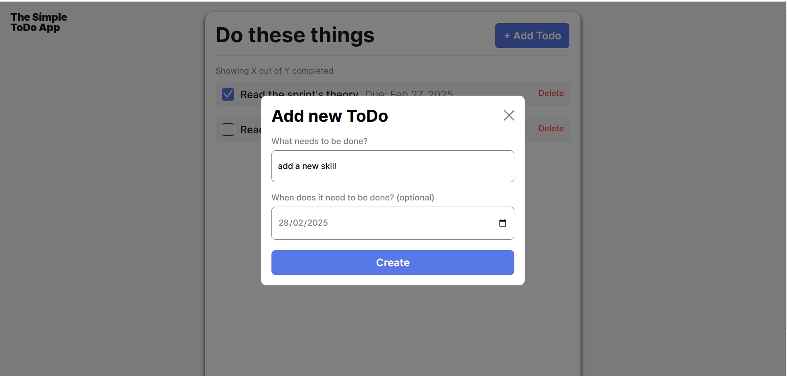
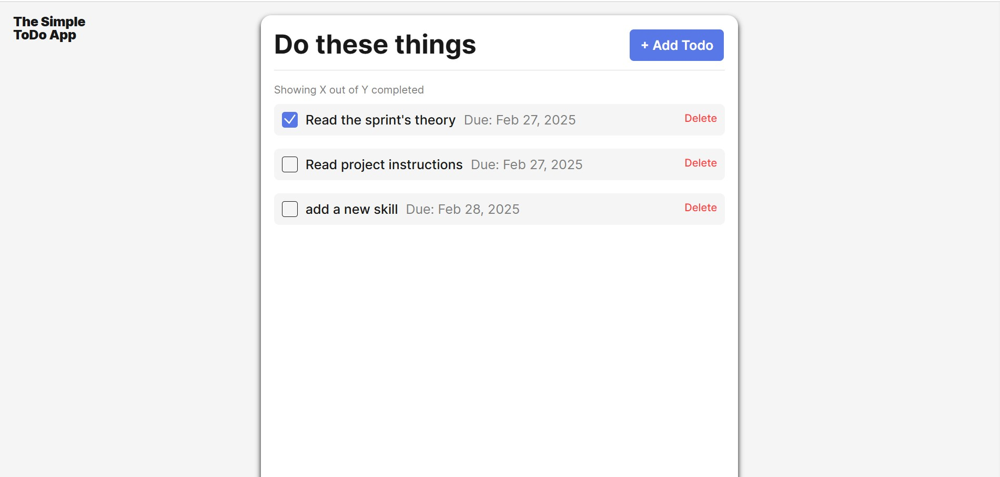
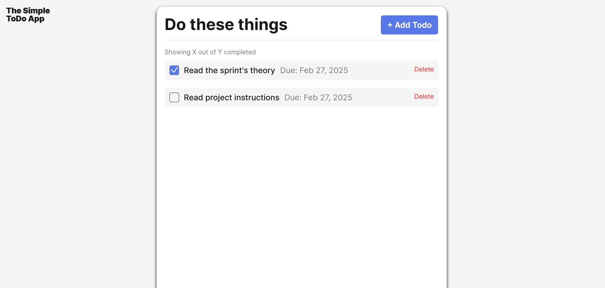

# Simple Todo App

This project implements functionality for a simple todo application. It can be used to track  
one's daily activities.

## Functionality
The project has three main and other sub functionalities:
- creating a new todo
- deleting a todo
- viewing a created todo

A form is used to create the todo and validates the inputs before adding up a todo.

## Technology

HTML, CSS and vanilla javascript were used in this project. Below are screenshots of the implemented features:

- adding a todo

- todo added

- delete the todo

## Deployment

This project is deployed on GitHub Pages:

- [https://seyonce12.github.io/se_project_todo-app/](https://seyonce12.github.io/se_project_todo-app/)
